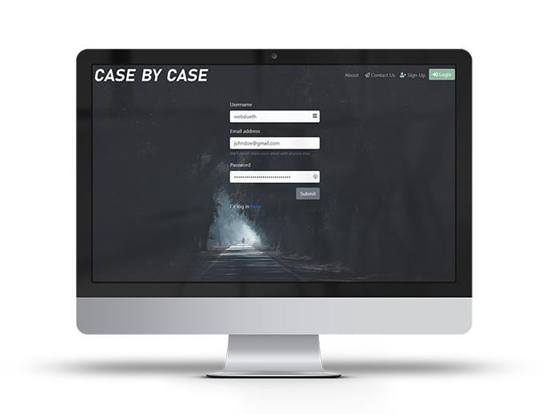
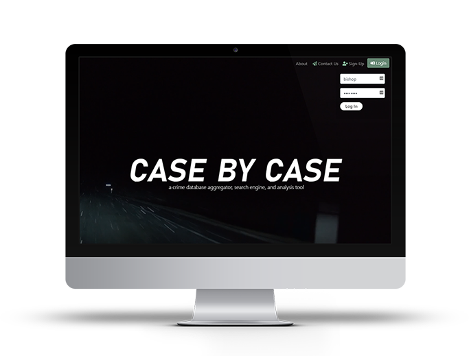
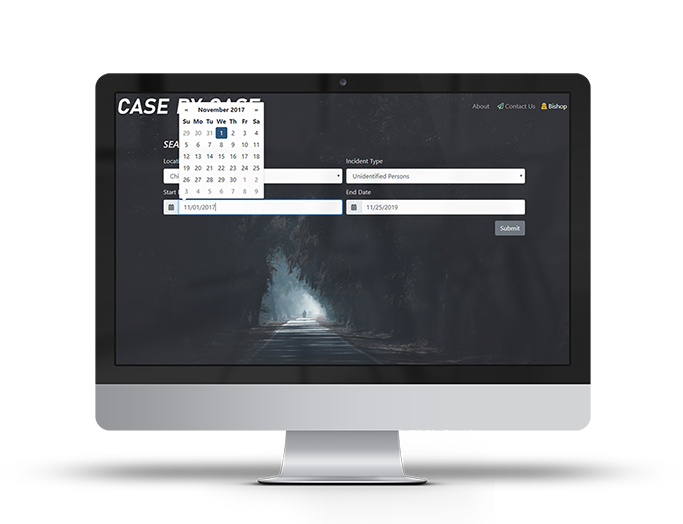

     

## Overview
TBD

## Languages/Technologies Used
- HTML, CSS, JavaScript
- [jQuery 3.4.1](http://code.jquery.com/)
- [Bootstrap 4.3.1](https://getbootstrap.com/docs/4.3)
- [Node](https://nodejs.org/en/docs/)
    - [Express 4.x](https://expressjs.com/en/4x/api.html)
    - [Express-Handlebars 3.1.0](https://www.npmjs.com/package/express-handlebars)
    - [MySQL2 1.6.5](https://www.npmjs.com/package/mysql2)
    - [Sequelize 5.x](https://sequelize.org/master/)
    - [Passport 0.4.0](http://www.passportjs.org/docs/)
    - [bcryptjs 2.4.3](https://www.npmjs.com/package/bcryptjs)
- [Moment.js 2.24.0](https://momentjs.com/)
- [Font Awesome 5.10.2](https://fontawesome.com/how-to-use/on-the-web/referencing-icons/basic-use)
- APIs
    - [Socrata Crime Data](https://moto.data.socrata.com/)
    - [Google Maps](https://developers.google.com/maps/documentation)
- [NamUs Public Data](https://public.opendatasoft.com/explore/dataset/namus-missings/information/)

## Getting Started
Visit LINK TO SITE.

### Prerequisites
- An internet browser with JavaScript enabled.
- A Case By Case account.

### Instructions
#### Sign-Up for a Case By Case Account
Users should click the **Sign-Up** button, then enter their desired username, their email address, and a password.

#### Login to Case By Case
Users should over over the **Login** button, then enter their username and password. Click **Log In** to complete the process.

#### Searching
Once you've logged in, click the drop to select a **Location**, an **Incident Type**, and then set your **Start Date** and **End Date** using the calendar picker. Then, click submit.

##### Missing Persons
TBD 

##### Unidentified Persons
TBD

##### Other
TBD